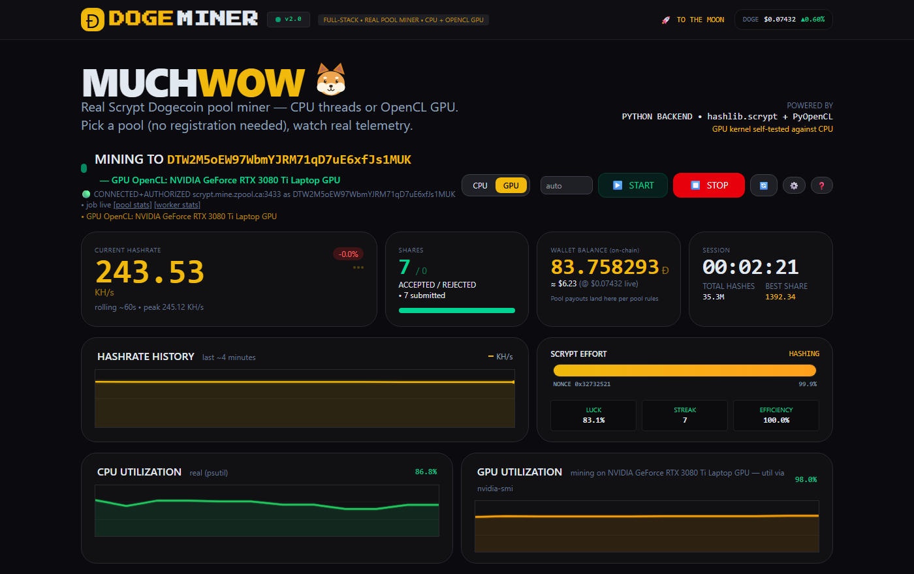
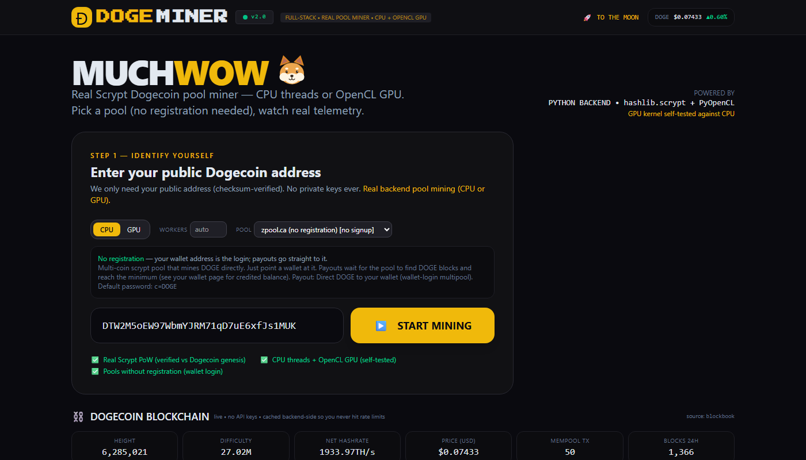
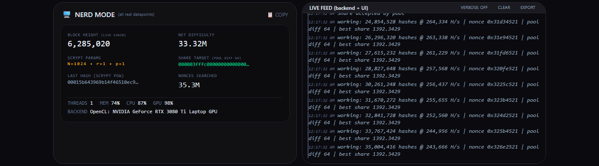
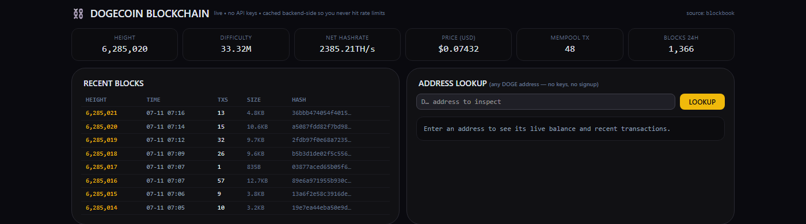

<div align="center">

# Ð DOGE MINER

**A full-stack, open-source Dogecoin pool miner — real Scrypt on CPU & GPU, live dashboard, zero registration.**

[](LICENSE)
[](backend/requirements.txt)
[](#-one-click-quick-start)
[-76B900)](#-gpu-mining)
[](backend/tests)
[](https://stevologic.github.io/doge-miner/)

*Much wow. No simulation — every number on screen is real.*



<sub>↑ Unedited capture: OpenCL GPU mining on a live pool — 243 KH/s, **7 / 0 shares accepted / rejected**, real charts, real chain data.</sub>

</div>

---

## ⚡ One-click quick start

| Platform | Do this |
|---|---|
| 🪟 **Windows** | double-click **`start.bat`** |
| 🍎 **macOS** / 🐧 **Linux** | `./start.sh` |
| 🐳 **Docker** | `docker compose up --build` |

Then open **http://localhost:8000** — or just **`http://doge.local`** 🐕: while the server runs it announces the `doge.local` hostname over mDNS (Bonjour), so the dashboard works by name from this machine *and any device on your network* (plain `doge.local` redirects to `:8000` when port 80 is free). Paste your public DOGE address (checksum-verified), pick a pool, hit **START MINING**. That's the whole tutorial — the default pool needs **no account**.

> `.local` names resolve natively on Windows 10+/macOS; Linux needs avahi + nss-mdns (standard on desktops). Opt out with `DOGE_NO_MDNS=1`.
>
> Browsers mark `http://doge.local` “Not secure” because only `https://` and `localhost` count as secure contexts — traffic still never leaves your LAN. The app detects this and keeps every copy button working via a clipboard fallback; use `http://localhost:8000` on the host machine if you want the clean address bar.

<div align="center">

</div>

## ✨ What you get

| | Feature | The honest details |
|---|---|---|
| ⛏️ | **Real pool mining** | Stratum client with auto-reconnect, `set_extranonce`, `client.get_version` replies, and a watchdog that flags pools that silently ignore a bad username. Share counters come *only* from pool responses. |
| 🎮 | **Real GPU mining** | Full scrypt OpenCL kernel (PBKDF2‑HMAC‑SHA256 → 1024× Salsa20/8 ROMix → PBKDF2). It must pass a self-test against `hashlib.scrypt` before it's used, and **every GPU share candidate is re-verified on CPU** before submission. No usable GPU → honest CPU fallback. |
| 🧵 | **CPU threads that scale** | `hashlib.scrypt` releases the GIL (~3.8× on 4 threads). Header prefixes cached per job — each hash only packs a nonce. |
| ⛓️ | **Key-free blockchain explorer** | Height, difficulty, network hashrate, price, mempool, recent blocks, address & tx lookups. Multi-provider failover (Blockbook → Blockchair → BlockCypher, CoinGecko price) with server-side caching — you never touch an API key or a rate limit. |
| 📊 | **Telemetry with no fiction** | Rolling hashrate, shares submitted/accepted/rejected, pool difficulty + exact share target, last PoW hash, best-share difficulty, statistical luck, CPU/MEM (psutil), GPU util (nvidia-smi or OpenCL duty cycle), on-chain balance. |
| 📜 | **A live feed of actual work** | Watch the miner mine in two places: the browser feed (VERBOSE toggle) **and** the terminal running the server — every event streams to stdout in real time (unbuffered), with wire/telemetry lines tagged `[v]` so you can `grep` them. Stratum traffic, per-worker nonce sweeps, GPU batch stats, chain requests, hashing heartbeats. |

<div align="center">


</div>

## 🧮 Correctness you can check

The PoW math isn't "probably right" — it's pinned against the real chain:

- The rebuilt **Dogecoin genesis block header matches the chain byte-for-byte**, and its scrypt hash passes the genesis target (little-endian, like real miners).
- **Block 1** reproduces its known hash through the stratum wire format (per-word prevhash swap — the thing naive miners get wrong).
- Share targets use the scrypt pool convention (**diff‑1 = `0xffff · 2²²⁴`**), exactly like cpuminer/cgminer.
- The GPU kernel is compared against CPU scrypt on random headers at startup, every run.

```bash
python -m unittest backend.tests.test_miner backend.tests.test_chain_pools   # 63 tests
```

Live-verified too: real shares **accepted by zpool** during development (GPU, static diff `d=64`, 100% efficiency).

## 🏊 Pools (all handshake-verified)

| Pool | Registration | Login | Payout |
|---|---|---|---|
| **zpool.ca** *(default)* | **none — just mine** | your DOGE wallet address | DOGE direct to wallet |
| AikaPool | free account | `username.worker` | DOGE |
| litecoinpool.org | free account | `username.worker` | LTC (merged-mines DOGE) |
| F2Pool | free account | `account.worker` | LTC + DOGE ⚠️ *accepts any username — typos mine into the void* |
| ViaBTC | free account | `account.worker` | LTC + DOGE (merged mining, automatic DOGE) |
| AntPool | free account | `subaccount.worker` | LTC + DOGE (merged mining, daily payouts) |
| PowerPool | free account | `username.worker` | your pick: DOGE, LTC, BTC, USDC… (hourly) |
| Custom | — | anything | your pool's rules |

💡 zpool honors password options like `c=DOGE` (payout coin) and `d=N` (static difficulty). Low static difficulty (e.g. `c=DOGE,d=64`) gets CPU/GPU miners frequent accepted shares.

## 🎮 GPU mining

- Needs `pyopencl` + `numpy` (start scripts install them automatically; skipped gracefully) and an OpenCL runtime from your GPU driver.
- Multi-GPU: the discrete GPU is picked automatically; override with `DOGE_GPU_DEVICE=<index>`. Batch size: `DOGE_GPU_BATCH`.
- Utilization telemetry: nvidia-smi when available; on AMD/Intel the miner reports the real **OpenCL kernel duty cycle** (source labeled in the UI).
- Docker GPU passthrough needs the NVIDIA Container Toolkit + an OpenCL ICD; otherwise the container mines on CPU.

## 🔌 API

```
POST /api/start     {wallet, mode: cpu|gpu, workers?, pool_id?, pool_host?, pool_port?, pool_user?, pool_pass?}
POST /api/stop
GET  /api/stats     full mining + system telemetry (poll it; never blocks)
GET  /api/pools     pool presets with registration info
GET  /api/chain/summary | /api/chain/blocks?limit=N | /api/chain/address/{addr} | /api/chain/tx/{txid}
GET  /api/health
```

Env overrides: `POOL_HOST` / `POOL_PORT` (initial pool without UI config).

## 🎨 Frontend styling (no CDNs)

The UI ships a locally compiled **Tailwind v4** stylesheet (`frontend/tailwind.css`) — no runtime CDN compile, works offline. Rebuild after markup changes:

```bash
npm i tailwindcss @tailwindcss/cli
# input.css: @import "tailwindcss"; @source "<path>/frontend/index.html";
npx @tailwindcss/cli -i input.css -o frontend/tailwind.css --minify
```

Icons and the link-preview card (`frontend/og.png`, `apple-touch-icon.png`, `icon-192/512.png`, `favicon.ico`) are generated from the site's own CSS, so they never drift from the hero. Regenerate after a brand change:

```bash
python scripts/make_brand_assets.py frontend
```

That needs `playwright` (plus `playwright install chromium`) and `Pillow` — build-time only, not miner dependencies. The same command run against a `gh-pages` checkout refreshes the assets for doge-miner.io.

## 🔍 Transparency

- Share counters are driven exclusively by real pool responses.
- "WALLET BALANCE" is the live on-chain balance for your address.
- You will never receive DOGE *from this app* — payouts come from your pool once your shares reach its minimum (check the `[pool stats]` / `[worker stats]` links in the header).
- Educational project. CPU/GPU hashrates are tiny next to ASICs — expect real accepted shares, not riches. Not financial advice.

---

<div align="center">
<sub>

**[Website](https://stevologic.github.io/doge-miner/)** · **[MIT License](LICENSE)** — free forever

🐕 *Tokens aren't cheap — if this project made you smile, a little Ð for the creator goes a long way:*
`DTW2M5oEW97WbmYJRM71qD7uE6xfJs1MUK`

</sub>
</div>
